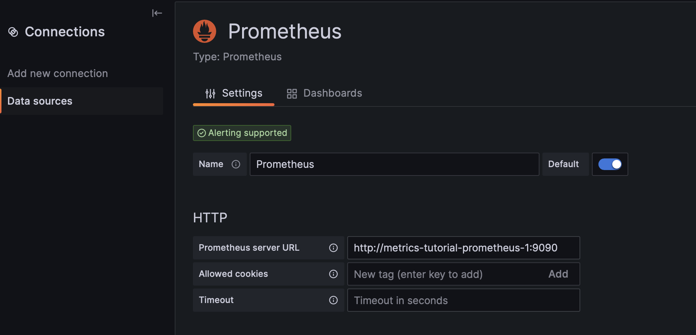

# ZeroTier Observability Metrics Tutorial

This repository has an example docker-compose configuration and setup scripts to run a ZeroTier network along with an observability stack based on Prometheus and Grafana.

To run this locally, you'll need the following tools installed:

- Docker + docker-compose
- jq

We've tested this demo on MacOS and Linux; on Windows, you'll need to use WSL2 for a local Linux environment. (Note: pull requests to add PowerShell support for the setup script are welcome!)

You can use this type of monitoring pipeline to measure the health and activity of your networks, whether you're using our [managed environment](https://my.zerotier.com) or hosting your own controller. For this example, we're running a standalone controller, which allows us to avoid capturing and injecting a valid ZeroTier Central API token into the demo environment, but the same observability tools and configuration methods will work for managed networks as well.

For more information on the full set of metrics we expose and how to configure your own Prometheus instance to extract them for visualization and alerting, see the [ZeroTierOne README](https://github.com/zerotier/ZeroTierOne#prometheus-metrics).

## Preparation

```

$ docker-compose up -d
$ ./setup.sh

```

## Grafana Setup

Next, open `http://localhost:3000/` in your browser and follow the steps below to configure dashboards.

TODO: add screenshots for each step below

1. Login (admin/admin; set a new password or click 'skip')
2. Connections -> Data Sources -> New Data Source
3. Select 'Prometheus' (first option)
4. Set the prometheus server URL: `http://metrics-tutorial-prometheus-1:9090`
  
5. Click 'Save and test'; then 'Explore view'
  
6. Select 'zt_packet' in the 'Metric' dropdown, then 'Last 15 minutes' in the range picker in the upper-right. Click 'Run query' and the graph will be populated in the bottom half of the screen.
  
7. You can also see the status of the Prometheus jobs directly: `http://localhost:9090`
  

## Cleanup

```

$ ./cleanup.sh

```

## Next Steps

Now that you've set up a basic pipeline, you can try creating a custom dashboard reporting ZeroTier metrics.

TODO: find good Grafana setup tutorial

The following metrics in particular may prove useful for general health + activity monitoring:

- `zt_packet` (labeled by rx/tx direction, peer node ID, network ID, etc.)
- `zt_peer_path` (active paths to known network peers)
